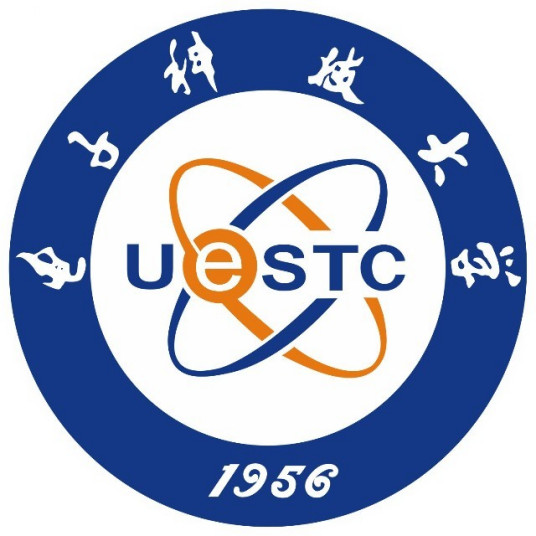

Yisi Luo (罗倚斯)
======

&nbsp;&nbsp;&nbsp;&nbsp;&nbsp;&nbsp;&nbsp;&nbsp;&nbsp;&nbsp;

- Greetings! I received my bachelor degree in information and computing sciences at the School of Mathematical Sciences, University of Electronic Science and Technology of China (UESTC) in 2022, supervised by [Prof. Xile Zhao](https://zhaoxile.github.io). I am currently a Ph.D. student starting from 2024 at the School of Mathematics and Statistics, Xi’an Jiaotong University (XJTU), supervised by [Prof. Deyu Meng](https://gr.xjtu.edu.cn/en/web/dymeng).

- My research interests include low-rank tensor modeling and unsupervised learning for data recovery, e.g., image inpainting, deraining, seismic denoising. I served as a reviewer/PC for CVPR, ICCV, ECCV, AAAI, NeurIPS, ACM MM, SIAM J. Imag. Sci., IEEE TPAMI, TCSVT, TGRS, TII, etc.

- E-mail: yisiluo1221@foxmail.com
  
&nbsp;&nbsp;Projects
======
- 
- 

&nbsp;&nbsp;Publications
======
- **Yisi Luo**, Xile Zhao, and Deyu Meng, ''Continuous Representation Methods, Theories, and Applications: An Overview and Perspectives,'' arXiv:2505.15222, 2025. [<a href="https://arxiv.org/abs/2505.15222">arXiv</a>] [<a href="https://github.com/YisiLuo/Continuous-Representation-Zoo">repository</a>]

- **Yisi Luo**, Xile Zhao, Kai Ye, and Deyu Meng, ''STINR: Deciphering Spatial Transcriptomics via Implicit Neural Representation,'' ***IEEE/CVF Conference on Computer Vision and Pattern Recognition (CVPR)***, 2025. [<a href="https://github.com/YisiLuo/STINR">code</a>]

- **Yisi Luo**, Xile Zhao, Kai Ye, and Deyu Meng, ''NeurTV: Total Variation on the Neural Domain,'' ***SIAM Journal on Imaging Sciences***, 2025. [<a href="https://arxiv.org/abs/2405.17241">arXiv</a>] [<a href="https://github.com/YisiLuo/NeurTV">code</a>]

- **Yisi Luo**, Xile Zhao, and Deyu Meng, ''Revisiting Nonlocal Self-Similarity from Continuous Representation,'' ***IEEE Transactions on Pattern Analysis and Machine Intelligence***, 2024. [<a href="https://arxiv.org/abs/2401.00708">arXiv</a>] [<a href="https://github.com/YisiLuo/CRNL">code</a>]
  
- **Yisi Luo**, Xile Zhao, Zhemin Li, Michael K. Ng, and Deyu Meng, ''Low-Rank Tensor Function Representation for Multi-Dimensional Data Recovery,'' ***IEEE Transactions on Pattern Analysis and Machine Intelligence***, 2024. (ESI highly cited paper) [<a href="https://arxiv.org/abs/2212.00262">arXiv</a>] [<a href="https://github.com/YisiLuo/LRTFR">code</a>]

- **Yisi Luo**, Xile Zhao, Taixiang Jiang, Yi Chang, Michael K. Ng, and Chao Li, ''Self-Supervised Nonlinear Transform-Based Tensor Nuclear Norm for Multi-Dimensional Image Recovery,'' ***IEEE Transactions on Image Processing***, 2022. [<a href="https://arxiv.org/abs/2105.14320">arXiv</a>] [<a href="https://github.com/YisiLuo/S2NTNN">code</a>]

- **Yisi Luo**, Xile Zhao, Deyu Meng, and Taixiang Jiang, ''HLRTF: Hierarchical Low-Rank Tensor Factorization for Inverse Problems in Multi-Dimensional Imaging,'' ***IEEE/CVF Conference on Computer Vision and Pattern Recognition (CVPR)***, 2022. [<a href="https://github.com/YisiLuo/HLRTF">code</a>]

- **Yisi Luo**, Xile Zhao, Taixiang Jiang, Yubang Zheng, and Yi Chang, ''Hyperspectral Mixed Noise Removal Via Spatial-Spectral Constrained Unsupervised Deep Image Prior,'' ***IEEE Journal of Selected Topics in Applied Earth Observations and Remote Sensing***, 2021. [<a href="https://arxiv.org/abs/2008.09753">arXiv</a>] [<a href="https://github.com/YisiLuo/S2DIP">code</a>]

- Zitai Xu\*, **Yisi Luo**\*, Bangyu Wu, and Deyu Meng, ''S2S-WTV: Seismic Data Noise Attenuation Using Weighted Total Variation Regularized Self-Supervised Learning,'' ***IEEE Transactions on Geoscience and Remote Sensing***, 2023. (\*Equal contribution)

- Junhao Zhuang\*, **Yisi Luo**\*, Xile Zhao, Taixiang Jiang, Yi Chang, and Jun Liu, ''Unsupervised Video Rain Streaks Removal with Deep Foreground-Background Modeling,'' ***Journal of Computational and Applied Mathematics***, 2023. (\*Equal contribution)

- Junhao Zhuang\*, **Yisi Luo**\*, Xile Zhao, and Taixiang Jiang, ''Reconciling Hand-Crafted and Self-Supervised Deep Priors for Video Directional Rain Streaks Removal,'' ***IEEE Signal Processing Letters***, 2021. (\*Equal contribution)

- Yanyi Li, Xi Zhang, **Yisi Luo**\#, and Deyu Meng, ''Deep Rank-One Tensor Functional Factorization for Multi-Dimensional Data Recovery'', ***AAAI Conference on Artificial Intelligence (AAAI)***, 2025. (\#Corresponding author)

- Guancheng Zhou, **Yisi Luo**\#, Xile Zhao, Deyu Meng\#, ''Efficient Arbitrary-Scale Image Super-Resolution via Functional Tensor Decomposition'', ***IEEE Transactions on Multimedia***, 2025. (\#Corresponding author)

- Ruihua Chen, Bangyu Wu\#, Meng Li, and **Yisi Luo**\#, ''Full Waveform Inversion with Velocity Model Low-Rank Implicit Neural Representation'', ***IEEE Transactions on Geoscience and Remote Sensing***, 2025. (\#Corresponding author)

- Zitai Xu, Bangyu Wu\#, **Yisi Luo**\#, Liuqing Yang, and Yangkang Chen, ''SelfMixed: Self-supervised Mixed Noise Attenuation for Distributed Acoustic Sensing Data'', ***Geophysics***, 2024. (\#Corresponding author)

- Jiayi Li, Jinyu Xie, **Yisi Luo**\#, Xile Zhao\#, and Jianli Wang, ''H2TF for Hyperspectral Image Denoising: Where Hierarchical Nonlinear Transform Meets Hierarchical Matrix Factorization'', ***IEEE Geoscience and Remote Sensing Letters***, 2023. (\#Corresponding author)

- Junhao Zhuang, **Yisi Luo**, Xile Zhao, Taixiang Jiang, and Bichuan Guo, ''UConNet: Unsupervised Controllable Network for Image and Video Deraining,'' ***ACM International Conference on Multimedia (ACM MM)***, 2022. [<a href="https://raw.githubusercontent.com/YisiLuo/YisiLuo.github.io/master/supplementary_materials.pdf">supplementary materials</a>]
  
- Zitai Xu, **Yisi Luo**, Bangyu Wu, Deyu Meng, and Yangkang Chen, ''Deep Nonlocal Regularizer: A Self-Supervised Learning Method for 3D Seismic Denoising,'' ***IEEE Transactions on Geoscience and Remote Sensing***, 2024.

- Jiangjun Peng, **Yisi Luo**, Xiangyong Cao, Shuang Xu, and Deyu Meng, ''Beyond Low-rankness: Guaranteed Matrix Recovery via Modified Nuclear Norm,'' ***International Joint Conference on Artificial Intelligence (IJCAI)***, 2025.

- Shengrui Wang, **Yisi Luo**, Sanfu Li, Jiangjun Peng, and Bangyu Wu, ''Efficient Seismic Random Noise Attenuation Via KAN-Empowered Neural Low-Rank Representation,'' ***IEEE Transactions on Geoscience and Remote Sensing***, 2025.

- Jianli Wang, Tingzhu Huang, Xile Zhao, **Yisi Luo**, and Taixiang Jiang, ''CoNoT: Coupled Nonlinear Transform-Based Low-Rank Tensor Representation for Multi-Dimensional Image Completion,'' ***IEEE Transactions on Neural Networks and Learning Systems***, 2022.

- Tingwei Zhou, Xile Zhao, Jianli Wang, **Yisi Luo**, Min Wang, Xiaoxuan Bai, Hong Yan, ''DTR: A Unified Deep Tensor Representation Framework for Multimedia Data Recovery,'' ***IEEE Transactions on Multimedia***, 2025.

- Tingwei Zhou, Xile Zhao, Weihao Wu, Jianli Wang, **Yisi Luo**, ''Frequency-Aware Implicit Neural Representation for Multi-Dimensional Data Recovery,'' ***IEEE Transactions on Circuits and Systems for Video Technology***, 2025.

- Jinyu Xie, Hao Zhang, Xile Zhao, **Yisi Luo**, ''IRTF: A New Tensor Factorization for Irregular Multidimensional Data Recovery,'' ***Knowledge-Based Systems***, 2025.

- Pei Liu, Jiangjun Peng, **Yisi Luo**, Jing Fu, Jialin Li, Xiangyong Cao, ''DDFet: Infrared Small Target Detection via a Dual-Domain Fused Deep Unfolding Network,'' ***IEEE Journal of Selected Topics in Applied Earth Observations and Remote Sensing***, 2025.

- Kexin Shi, Jiangjun Peng, Jing Gao, **Yisi Luo**, and Shuang Xu, ''Hyperspectral Image Denoising via Double Subspace Deep Prior,'' ***IEEE Transactions on Geoscience and Remote Sensing***, 2024.

&nbsp;&nbsp;Awards
======
- 国家自然科学基金青年学生项目, 2024-2027

- 西安交大“学术之星”, 2024

- Huawei Scholarship, 2023 (华为奖学金)

- Outstanding Winner of 2021 ICM/MCM, 2021 (数学建模美赛 O 奖)

- AMS Award of 2021 ICM/MCM, 2021 (数学建模美赛美国数学会冠名奖)

- 2018-2019 China National Scholarship, 2019 (国家奖学金) 

- 2019-2020 China National Scholarship, 2020 (国家奖学金)

